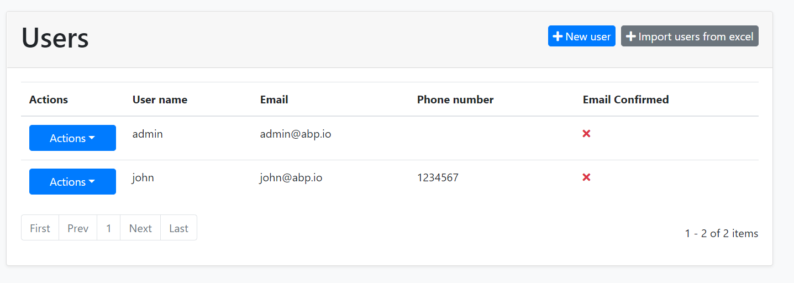

# Page Toolbar Extensions for Blazor UI

Page toolbar system allows you to add components to the toolbar of any page. The page toolbar is the area right to the header of a page. A button ("Import users from excel") was added to the user management page below:



You can add any type of view component item to the page toolbar or modify existing items.

## How to Set Up

In this example, we will add an "Import users from excel" button and execute a C# code for the user management page of the [Identity Module](../../../modules/identity.md). 

### Create a C# File

First, add a new C# file to your solution. We added inside the `/Pages/Identity/` folder of the `.Blazor` project:


We will use the [component override system](customization-overriding-components.md) in the Blazor. After creating a class inherits from the `UserManagement` component, we will override the `SetToolbarItemsAsync` method and add the toolbar item programmatically.

Here, the content of the overridden `SetToolbarItemsAsync` method.

```csharp
protected override async ValueTask SetToolbarItemsAsync()
{
    await base.SetToolbarItemsAsync();
    Toolbar.AddButton("Import users from excel", () =>
    {
        //TODO: Write your custom code
        return Task.CompletedTask;
    }, "file-import", Blazorise.Color.Secondary);
}
```
> In order to use the `AddButton` extension method, you need to add a using statement for the `Volo.Abp.AspNetCore.Components.Web.Theming.PageToolbars` namespace.

Here, the entire content of the file.

```csharp
using System.Threading.Tasks;
using Volo.Abp.AspNetCore.Components.Web.Theming.PageToolbars;
using Volo.Abp.DependencyInjection;
using Volo.Abp.Identity.Blazor.Pages.Identity;

namespace MyCompanyName.MyProjectName.Blazor.Pages.Identity
{
    [ExposeServices(typeof(UserManagement))]
    [Dependency(ReplaceServices = true)]
    public class CustomizedUserManagement : UserManagement
    {
        protected override async ValueTask SetToolbarItemsAsync()
        {
            await base.SetToolbarItemsAsync();
            Toolbar.AddButton("Import users from excel", () =>
            {
                //TODO: Write your custom code
                return Task.CompletedTask;
            }, "file-import", Blazorise.Color.Secondary);
        }
    }
}
```

When you run the application, you will see the button added next to the current button list. There are some other parameters of the `AddButton` method (for example, use `Order` to set the order of the button component relative to the other components).

## Advanced Use Cases

While you typically want to add a button action to the page toolbar, it is possible to add any type of blazor component.

### Add A Blazor Component to a Page Toolbar

First, create a new blazor component in your project:


For this example, we've created a `MyToolbarComponent` component under the `/Pages/Identity/` folder.

`MyToolbarComponent.razor` content:

````csharp
<Button Color="Color.Dark">CLICK ME</Button>
````
We will leave the `MyToolbarComponent.razor.cs` file empty.

Then you can add the `MyToolbarComponent` to the user management page toolbar:

````csharp
protected override async ValueTask SetToolbarItemsAsync()
{
    await base.SetToolbarItemsAsync();
    Toolbar.AddComponent<MyToolbarComponent>();
}
````

* If your component accepts parameters, you can pass them as key/value pairs using the `arguments` parameter.

#### Permissions

If your button/component should be available based on a [permission/policy](../../fundamentals/authorization.md), you can pass the permission/policy name as the `RequiredPolicyName` parameter to the `AddButton` and `AddComponent` methods.

### Add a Page Toolbar Contributor

If you perform advanced custom logic while adding an item to a page toolbar, you can create a class that implements the `IPageToolbarContributor` interface or inherits from the `PageToolbarContributor` class:

````csharp
public class MyToolbarContributor : PageToolbarContributor
{
    public override Task ContributeAsync(PageToolbarContributionContext context)
    {
        context.Items.Insert(0, new PageToolbarItem(typeof(MyToolbarComponent)));
        return Task.CompletedTask;
    }
}
````

* You can use `context.ServiceProvider` to resolve dependencies if you need.

Then add your class to the `Contributors` list:

````csharp
protected override async ValueTask SetToolbarItemsAsync()
{
    await base.SetToolbarItemsAsync();
    Toolbar.Contributors.Add(new PageContributor());
}
````

